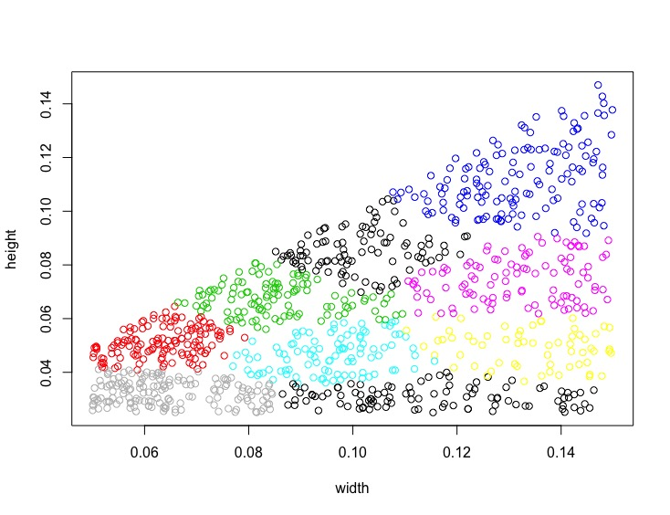

Allows to cluster 2-dimensional data with k-means using intersection over union distance. 
This is useful for anchors initialization in the YOLO-family of models for object detection.
See Redmon et al. (2016) <arXiv:1612.08242>, Redmon et al. (2016) <arXiv:1804.02767>.
  
```r
library(kmeansiou)
set.seed(42)
nr = 1000
width = runif(nr, min = 0.05, max = 0.15)
height = runif(nr, min = 0.025, max = w)
boxes = cbind(width, height)
res = kmeans_iou(boxes, k = 9, iter = 10)
plot(boxes, col = res$cluster_membership)
```


